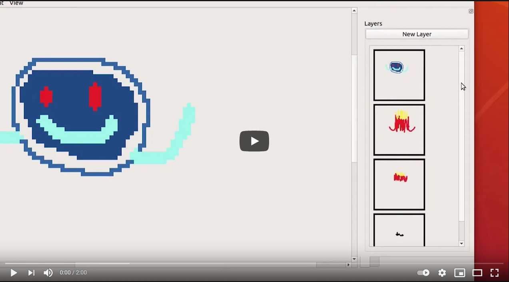

# Sprite-Editor

The Sprite Editor allows users to create, save, and edit sprites. Files are saved by default as .gif files. 

Video Link: https://youtu.be/yA0y7A_2idY

# Qt Sprite Editor

## Dependencies
This project only has dynamic dependencies for Qt.
Any libraries otherwise used by this project are header-only, and
are already included in this repository.

## Plugins
Plugins must be installed in the same directory as the build
executable. If built with Qt Creator, this should be a folder "build-a7-Desktop-TARGET",
where "TARGET" is the build mode, such as Release or Debug.

In that directory, all plugins must be placed in there. Only shared
objects should be placed there, ending in ".so".

## Plugin SDK
The Plugin SDK is written in a common subset of C++ and C such that
plugins can be natively written in either. The example plugins
are written in C++, but theoretically any language could be used to
write plugins so long as they could use the C ABI.

## Usage
Under the File menu, most important actions, such as changing the project
dimensions, opening a file, and exporting as a GIF are present.

The Edit submenu is currently unused, but in the future may be used
for Undo, Redo, and other actions.

Under View, a reset scale button is present to return the editing window
to 100% zooming.
